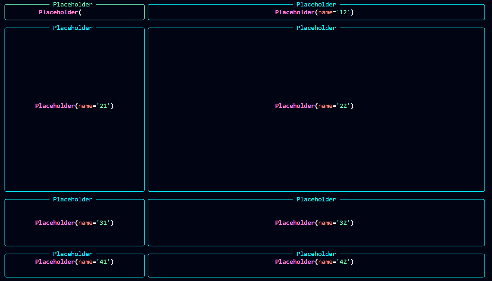

# TUILANG

Create a runnable Python code quickly for TUI Rich-based applications.

# Sample code and output

## Sample code

Create four rows with 2 columns each and with a portion of 1, 6, 2, 1 respectively.

Each row's two columns have a 3:7 width ratio.

```
<layout(
    <content(
        <row[fraction=1](
            <col[fraction=3]
            <col[fraction=7]
        )
        <row[fraction=6](
            <col
            <col
        )
        <row[fraction=2](
            <col
            <col
        )
        <row[fraction=1](
            <col
            <col
        )
    )
)
```

## Screenshot output


